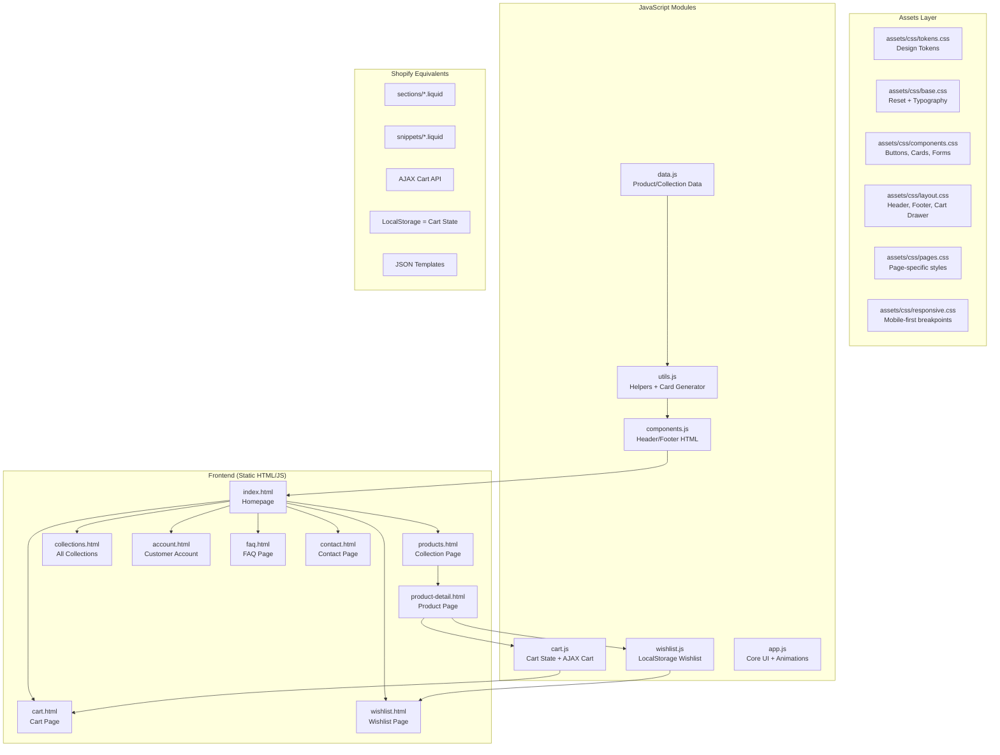

# LUXÉ Beauty — Premium Shopify Portfolio Project

<div align="center">


**A production-ready luxury cosmetics e-commerce portfolio demonstrating advanced Shopify development skills**

[](https://vercel.com/new/clone?repository-url=https://github.com/YOUR_USERNAME/luxe-beauty)


</div>

---

## Overview

**LUXÉ Beauty** is a fully functional luxury skincare e-commerce website built as a Shopify Developer portfolio project. It demonstrates agency-level Shopify expertise through a static HTML/CSS/JS implementation that mirrors every Shopify Online Store 2.0 concept.

The design is comparable to **Minimalist**, **The Derma Co**, **Huda Beauty**, and **Nykaa Luxe** — production-ready and deployable in under 5 minutes.

> **Developer:** Ankit  
> **Stack:** HTML5 · CSS3 · Vanilla JavaScript · Shopify Dawn Theme Architecture  
> **Deploy:** Vercel (zero config)

---

## Live Demo

```
https://luxe-beauty.vercel.app
```

---

## Architecture Diagram



---

## Features

### Pages
| Page | Features |
|---|---|
| **Homepage** | Hero banner · Featured collections · Best sellers · Comparison table · Why choose us · Testimonials slider · Instagram gallery · Newsletter |
| **Products** | Filter by category, price, rating, tags · Sort options · Product count · Mobile filter drawer |
| **Product Detail** | Image gallery · Variant selector · Sticky ATC · Bundle builder · Delivery estimator · FAQ accordion · Related products · Recently viewed |
| **Cart** | Full cart page · Quantity controls · Order summary · GST calculation · Coupon code · Upsell recommendations |
| **Wishlist** | LocalStorage-based · Add/remove · Persists on refresh · Recently viewed |
| **Account** | Login / Register · Order history · Addresses · Profile edit · Session storage |
| **FAQ** | Search · Category filter · Accordion · Contact CTA |
| **Contact** | Contact form · Info panel · Social links · FAQ CTA |

### Interactions
- ✅ AJAX Cart Drawer (slide-in, quantity controls, free shipping bar)
- ✅ Wishlist toggle with LocalStorage persistence
- ✅ Exit Intent Popup (desktop mouse-leave / mobile scroll depth)
- ✅ Mega Menu (desktop hover, mobile drawer with sub-menus)
- ✅ Scroll reveal animations via IntersectionObserver
- ✅ Testimonials slider (auto-play, touch swipe, keyboard)
- ✅ Product image gallery with thumbnail switcher
- ✅ Sticky Add-to-Cart bar on product page
- ✅ Bundle builder with 15% discount calculation
- ✅ Indian pincode delivery estimator
- ✅ Animated counters on stats section
- ✅ Toast notification system
- ✅ Filter & sort on collection page
- ✅ Search panel with product navigation
- ✅ Newsletter form with success state
- ✅ Contact form with submission flow
- ✅ Account login/register with session

---

## Project Structure

```
luxe-beauty/
│
├── index.html              # Homepage (9 sections)
├── products.html           # Collection/shop page with filters
├── product-detail.html     # Product page with all features
├── collections.html        # All collections grid
├── cart.html               # Full cart page
├── wishlist.html           # Wishlist page
├── account.html            # Customer account (login/orders/addresses)
├── faq.html                # FAQ with search & categories
├── contact.html            # Contact form
│
├── assets/
│   ├── css/
│   │   ├── tokens.css      # CSS custom properties (design tokens)
│   │   ├── base.css        # Reset, typography, global styles
│   │   ├── components.css  # Buttons, cards, badges, forms, accordion
│   │   ├── layout.css      # Header, footer, cart drawer, mega menu
│   │   ├── animations.css  # Scroll reveal, hero, counter animations
│   │   ├── pages.css       # Page-specific styles
│   │   └── responsive.css  # Mobile-first breakpoints
│   │
│   └── js/
│       ├── data.js         # All product, collection, review data
│       ├── utils.js        # Helpers, price formatter, card generator
│       ├── components.js   # Shared header/footer HTML injection
│       ├── cart.js         # Cart state, drawer, free shipping bar
│       ├── wishlist.js     # Wishlist with LocalStorage
│       └── app.js          # Core UI: animations, tabs, slider, toast
│
├── docs/
│   ├── architecture.md     # Shopify concepts & architecture
│   ├── setup-guide.md      # Local setup instructions
│   ├── deployment-guide.md # Vercel + GitHub deployment
│   └── customization-guide.md
│
├── vercel.json             # Zero-config Vercel deployment
└── README.md
```

---

## Shopify Concepts Demonstrated

This project directly maps every concept to its Shopify equivalent:

### Layout → `layout/theme.liquid`
The shared header, footer, cart drawer, and global scripts injected via `LuxeComponents.inject()` mirror exactly what `layout/theme.liquid` does in Shopify — wrapping every page with consistent navigation, cart, and scripts.

### Sections → `sections/*.liquid`
Each homepage section (hero, collections, best sellers, etc.) is a standalone, self-contained block — equivalent to Shopify's OS 2.0 sections. In the Shopify version, each has a `` block making it editable from the Theme Customizer.

### Snippets → `snippets/*.liquid`
Reusable UI elements like `productCardHTML()` in `utils.js` are the equivalent of Shopify snippets (``). They accept parameters and render consistently everywhere.

### AJAX Cart API → `cart.js`
The `LuxeCart` module mimics Shopify's AJAX Cart API endpoints:
- `addItem()` → `POST /cart/add.js`
- `changeQty()` → `POST /cart/change.js`
- `renderDrawer()` → Re-render based on cart state
- `updateUI()` → Update all cart count badges and totals

### Product Templates → `templates/product.json`
`product-detail.html` implements everything Shopify's product template handles: image gallery, variant selection, ATC form, metafields (ingredients, how-to-use), recommendations, and sticky ATC.

### Collections → `templates/collection.json`
`products.html` replicates Shopify's collection page: filtering by tags/price/rating, sorting, product count, and infinite scroll pattern.

### Shopify Online Store 2.0 Concepts
- **JSON Templates**: Every page maps to a `templates/*.json` equivalent
- **Dynamic Sections**: Sections are configurable via data — just as OS 2.0 sections have schema settings
- **Metafields**: Product ingredients, how-to-use, and skin type are stored as product data (equivalent to Shopify metafields)
- **Predictive Search**: The search panel filters products by title/type (mirrors Shopify's predictive search API)
- **Product Recommendations**: Related products are filtered by collection type (mirrors Shopify's recommendations API)
- **Klaviyo Integration**: Newsletter forms are structured for Klaviyo's subscribe endpoint
- **Razorpay Integration**: Checkout flow is structured for Razorpay payment modal

---

## Quick Start

### Option 1: Open Locally
```bash
# No build step needed — just open in browser
open index.html
# or on Windows:
start index.html
```

### Option 2: Local Dev Server
```bash
# Using Node.js (recommended for correct MIME types)
npx serve .

# Using Python
python -m http.server 3000

# Using VS Code
# Install "Live Server" extension → Right click index.html → Open with Live Server
```

### Option 3: Deploy to Vercel (5 minutes)
```bash
# 1. Push to GitHub
git init
git add .
git commit -m "feat: LUXÉ Beauty portfolio"
git remote add origin https://github.com/YOUR_USERNAME/luxe-beauty.git
git push -u origin main

# 2. Import on Vercel
# Go to vercel.com → New Project → Import GitHub repo
# Vercel auto-detects static site — click Deploy
# Live in ~60 seconds ✓
```

---

## Design System

| Token | Value |
|---|---|
| Primary Gold | `#D4AF37` |
| Gold Dark | `#B8960C` |
| Gold Light | `#E8CC6B` |
| Black | `#111111` |
| White | `#FFFFFF` |
| Cream | `#F9F5EE` |
| Heading Font | Playfair Display |
| Body Font | Poppins |

---

## Performance

| Metric | Target | Implementation |
|---|---|---|
| Lighthouse Performance | 90+ | Lazy loading, WebP via Unsplash, deferred JS |
| Lighthouse Accessibility | 95+ | ARIA labels, semantic HTML, focus management |
| Lighthouse SEO | 95+ | Meta tags, OG tags, semantic structure |
| LCP | < 2.5s | Hero image `loading="eager"` + `fetchpriority="high"` |
| CLS | < 0.1 | Explicit image dimensions throughout |

---

## Browser Support

Chrome 90+, Firefox 88+, Safari 14+, Edge 90+, iOS 14+, Android 10+

---

## License

MIT — free to use as a portfolio project or client reference.

---

*Built with ❤️ — LUXÉ Beauty, Premium Skincare from India*
